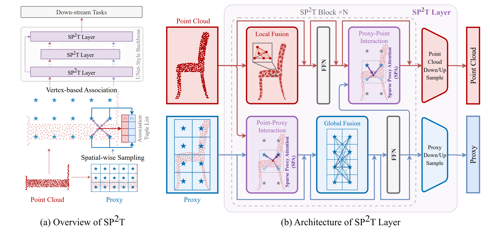

# SP<sup>2</sup>T: Sparse Proxy Attention for Dual-stream Point Transformer

The offical repository of the paper **SP<sup>2</sup>T: Sparse Proxy Attention for Dual-stream Point Transformer**.

Paper Link: [[arxiv](https://arxiv.org)]



## News

* Dec 16, 2024: First commit. 

## Quick Start

* Our model file is location in ./sp2t or ./pointcept.
* The training log and val/test result is location in ./submit. We will update the model if our paper is accepted.
* The config is location in ./config.

## Installation

### Environment

* Basic Environment

Please use the setup.sh to install requirements.

```
bash setup.sh
```

* Flash Attention

Please follow the offical guide in repository of Flash Attention.


## Data Prepare

Please follow the offical guide of Pointcept fot prepare Scannet, Scannet200, S3DIS and nuScenes.

## Model Zoo

### Indoor Semantic Segmentation

#### ScanNet

Currently, mainstream point cloud models use over-segmentation TTA augmentation on the Test set of Scannet. 
Unfortunately, we have not found any open-source implementations for over-segmentation. To ensure fairness, we re-tested the existing mainstream point cloud models using TTA augmentation on the Val set as the standard.

| Model | BenchMark | Additional Data | Val mIOU | Test mIOU | Config | Weight | Val Result | Test Result |
|:-----:|:---------:|:---------------:|:--------:|:---------:|--------|--------|:----------:|:-----------:|
| MinkUnet | ScanNet | ✗ | 72.2 | 73.4 |  |  |  |  |
| Octformer (Reproduction) | ScanNet | ✗ | 74.6 | 70.7 |  |  |  |  |
| PTv2 | ScanNet | ✗ | 75.4 |  |  |  |  |  |
| Swin3d (Reproduction) | ScanNet | ✗ | 76.6 | 71.4 |  |  |  |  |
| PTv3 | ScanNet | ✗ | 77.5 | 73.6 |  |  |  |  |
| PTv3 + PPT | ScanNet | ✓ | 78.6 |   |  |  |  |  |
| SP<sup>2</sup>T | ScanNet | ✗ | 78.7 | 74.9  |  |  |  |  |

We are still working on over-segmentation and may update the test results employing over-segmentation in
the furture. 

#### ScanNet200

| Model | BenchMark | Additional Data | Val mIOU | Test mIOU | Config | Weight | Val Result | Test Result |
|:-----:|:---------:|:---------------:|:--------:|:---------:|--------|--------|:----------:|:-----------:|
| MinkUnet | ScanNet200 | ✗ | 25.0 | 25.3 |  |  |  |  |
| PTv1 | ScanNet200 | ✗ | 27.8 |  |  |  |  |  |
| PTv2 | ScanNet200 | ✗ | 30.2 |  |  |  |  |  |
| Octformer (Reproduction) | ScanNet200 | ✗ | 31.9 | 31.0 |  |  |  |  |
| PTv3 | ScanNet200 | ✗ | 35.2 | 34.0 |  |  |  |  |
| PTv3 + PPT | ScanNet200 | ✓ | 36.0 |  |  |  |  |  |
| SP<sup>2</sup>T | ScanNet200 | ✗ | 37.0 | 35.2  |  |  |  |  |

#### S3DIS

| Model | BenchMark | Additional Data | Area5 | 6-fold | Config | Weight |
|:-----:|:---------:|:---------------:|:--------:|:---------:|--------|--------|
| MinkUnet | S3DIS | ✗ | 65.4 | 65.4 |  |  |
| PTv2 | S3DIS | ✗ | 71.6 | 73.5 |  |  |
| Swin3d | S3DIS | ✗ | 72.5 | 76.9 |  |  |
| PTv3 | S3DIS | ✗ | 73.4 | 77.7 |  |  |
| SP<sup>2</sup>T | S3DIS | ✗ | 73.4 | 77.9 |  |  |

#### Example

Example running scripts are as follows:

```
# ScanNet
sh scripts/train.sh -g 4 -d scannet -c semseg-sppt-0-base -n semseg-sppt-0-base

# ScanNet200
sh scripts/train.sh -g 4 -d scannet200 -c semseg-sppt-0-base -n semseg-sppt-0-base

# S3DIS Area5
sh scripts/train.sh -g 4 -d s3dis -c semseg-sppt-area5-rpe -n semseg-sppt-area5-rpe

# S3DIS 6-fold (Take Area1 as a example)
sh scripts/train.sh -g 4 -d s3dis -c semseg-sppt-6fold-T1 -n semseg-sppt-6fold-T1
```

For Test, the example scirpts are as follows:

```
# ScanNet
sh scripts/test.sh -g 4 -d scannet -c semseg-sppt-0-base -n semseg-sppt-0-base

# ScanNet200
sh scripts/test.sh -g 4 -d scannet200 -c semseg-sppt-0-base -n semseg-sppt-0-base

# S3DIS Area5
sh scripts/test.sh -g 4 -d s3dis -c semseg-sppt-area5-rpe -n semseg-sppt-area5-rpe

# S3DIS 6-fold (Take Area1 as a example)
sh scripts/test.sh -g 4 -d s3dis -c semseg-sppt-6fold-T1 -n semseg-sppt-6fold-T1
```

### Indoor instance segmentation

#### ScanNet

| Model | BenchMark | mAP25 | mAP50 | mAP | Config | Weight |
|:-----:|:---------:|:---------------:|:--------:|:---------:|--------|--------|
| MinkUnet | ScanNet | 72.8 | 56.9 | 36.0 |  |  |
| PTv2 | ScanNet | 76.3 | 60.0 | 38.3 |  |  |
| PTv3 | ScanNet | 77.5 | 61.7 | 40.9|  |  |
| SP<sup>2</sup>T | ScanNet | 78.6 | 62.3 | 41.1 |  |  |

#### ScanNet200

| Model | BenchMark | mAP25 | mAP50 | mAP | Config | Weight |
|:-----:|:---------:|:---------------:|:--------:|:---------:|--------|--------|
| MinkUnet | ScanNet200 | 32.2 | 24.5 | 15.8 |  |  |
| PTv2 | ScanNet200 | 39.6 | 31.9 | 21.4 |  |  |
| PTv3 | ScanNet200 | 40.1 | 33.2 | 23.1 |  |  |
| SP<sup>2</sup>T | ScanNet200 | 41.2 | 34.3 | 23.3 |  |  |

#### Example

Example running scripts are as follows:

```
# ScanNet
sh scripts/train.sh -g 4 -d scannet -c insseg-sppt-0-base -n insseg-sppt-0-base

# ScanNet200
sh scripts/train.sh -g 4 -d scannet200 -c insseg-sppt-0-base -n insseg-sppt-0-base
```

### Outdoor semantic segmentation

#### nuScenes

| Model | BenchMark | val mIOU | Config | Weight |
|:-----:|:---------:|:--------:|:--------:|:----:|
| MinkUnet | nuScenes | 73.3 |  |  |
| PTv2 | nuScenes | 80.2  |  |  |
| PTv3 | nuScenes | 80.4 |  |  |
| SP<sup>2</sup>T | nuScenes | 80.7 |  |

#### Example

Example running scripts are as follows:

```
# nuScenes
sh scripts/train.sh -g 4 -d scannet -c semseg-sppt-1-base -n semseg-sppt-1-base
```

## Train log, Test file and Test Result

We have provided the train log, test file and test result in the ./submit. We will open the weight of our model if the paper is accepted.

```
├─others
│  ├─scannet-semseg-octformer-v1m1-0-base
│  ├─scannet-semseg-pt-v3m1-0-base
│  ├─scannet-semseg-swin3d-v1m1-0-small
│  └─scannet200-semseg-pt-v3m1-0-base
└─sppt
    ├─nuscenes-semseg-sppt
    ├─s3dis-area5-semseg-sppt
    ├─scannet-insseg-sppt
    ├─scannet-semseg-sppt
    ├─scannet200-insseg-sppt
    └─scannet200-semseg-sppt
```

## Cite

If you find our work useful to your research, please cite our work :).

```
wait for arxiv.
```